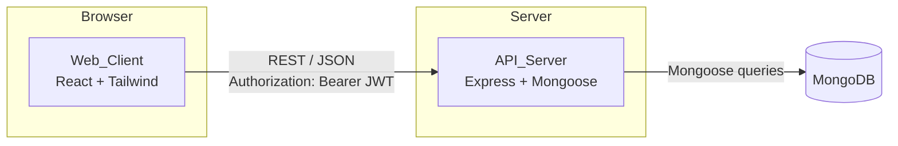
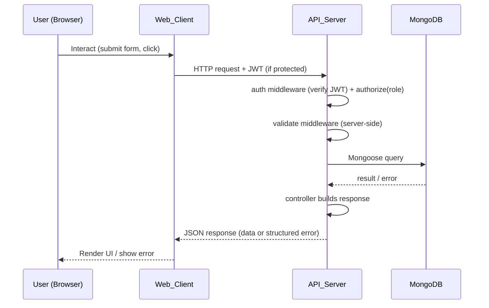
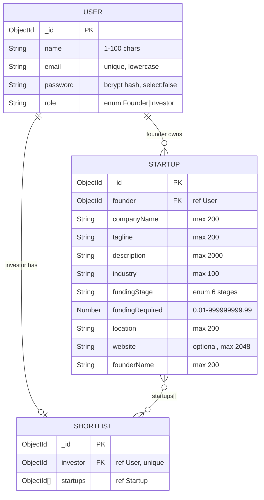

# Design Document — StartupFund

## Overview

StartupFund is a MERN stack platform that connects founders with investors. Founders register, create startup profiles with funding requirements, and manage them through a dashboard. Investors register, browse, search, filter, view, and shortlist startups through a discovery experience and a shortlist dashboard. The platform enforces role-based access, JWT authentication, dual-layer (client + server) form validation, structured error handling, and a responsive UI built with React and Tailwind CSS.

The system is composed of two deployable units that live in a single repository:

- **API_Server** — an Express.js REST API (Node.js) backed by MongoDB with Mongoose.
- **Web_Client** — a React.js single-page application styled with Tailwind CSS.

Scope is intentionally constrained to be achievable within 72 hours. It covers authentication and roles, founder startup CRUD, founder dashboard, investor browse/search/filter, startup details page, investor shortlist, investor dashboard, validation, error handling, responsive UI, and startup profile serialization round-trip. The design favors straightforward, well-understood patterns over premature optimization so the build stays on schedule.

### Design Goals

- **Clarity over cleverness.** Use standard MERN patterns that are quick to implement and easy to reason about.
- **Role separation.** Founder and Investor capabilities are distinct and enforced on both client and server.
- **Validation parity.** Field validation rules are mirrored on the client and server so users get immediate feedback while the server remains the source of truth.
- **Small, predictable surface.** A modest set of endpoints and pages that fully satisfy the 17 requirements without speculative features.

## Architecture

### High-Level Architecture

The Web_Client is a SPA that talks to the API_Server exclusively over REST/JSON. The API_Server talks to MongoDB via Mongoose. Authentication is stateless: the server issues a JWT on register/login, and the client attaches it to protected requests in the `Authorization: Bearer <token>` header. The server verifies the JWT, extracts the `userId` and `role` claims, and enforces role-based access via middleware.



### Request Lifecycle



### Layered Server Architecture

The API_Server follows a conventional layered structure that keeps transport, business, and data concerns separate (supports Requirement 8-style maintainability goals implicitly through clean layering):

- **Routes** — map HTTP methods/paths to controllers, attach middleware.
- **Middleware** — `authenticate`, `authorize(role)`, `validate(schema)`, `errorHandler`.
- **Controllers** — orchestrate calls to models/services, build responses, hand errors to the error handler.
- **Models** — Mongoose schemas that define data shape and persistence.
- **Validators** — reusable, pure validation functions shared by client and server where feasible.
- **Utils** — error classes, pagination helper.

### Folder Structure

A single repository containing two independently runnable packages. This keeps related code together while preserving a clean client/server boundary.

```
StartupFund/
├── server/
│   ├── src/
│   │   ├── config/
│   │   │   └── db.js                 # Mongoose connection
│   │   ├── models/
│   │   │   ├── User.js               # Auth + roles
│   │   │   ├── Startup.js            # Startup profiles
│   │   │   └── Shortlist.js          # Investor shortlists
│   │   ├── controllers/
│   │   │   ├── authController.js     # register, login, me
│   │   │   ├── startupController.js  # CRUD (founder)
│   │   │   ├── discoveryController.js# browse, search, filter, details
│   │   │   └── shortlistController.js# add, remove, list
│   │   ├── routes/
│   │   │   ├── authRoutes.js
│   │   │   ├── startupRoutes.js
│   │   │   ├── discoveryRoutes.js
│   │   │   └── shortlistRoutes.js
│   │   ├── middleware/
│   │   │   ├── auth.js               # authenticate + authorize
│   │   │   ├── validate.js           # runs validator schemas
│   │   │   └── errorHandler.js       # central error handler
│   │   ├── validators/
│   │   │   ├── authValidator.js      # register/login rules
│   │   │   └── startupValidator.js   # startup profile rules
│   │   ├── utils/
│   │   │   ├── errors.js             # AppError subclasses
│   │   │   └── pagination.js         # pure page/skip/limit math
│   │   └── app.js                    # Express app + route mounting
│   ├── package.json
│   └── .env                          # PORT, MONGO_URI, JWT_SECRET
├── client/
│   ├── src/
│   │   ├── api/
│   │   │   └── client.js             # axios instance + interceptors
│   │   ├── components/
│   │   │   ├── layout/               # Navbar, Footer, Layout
│   │   │   ├── forms/                # FormField, StartupForm, AuthForm
│   │   │   ├── ui/                   # Button, ErrorMessage, EmptyState,
│   │   │   │                          Pagination, ConfirmDialog, Spinner
│   │   │   └── startups/            # StartupCard, SearchBar, FilterPanel
│   │   ├── pages/
│   │   │   ├── Register.jsx
│   │   │   ├── Login.jsx
│   │   │   ├── FounderDashboard.jsx
│   │   │   ├── StartupForm.jsx       # create + edit
│   │   │   ├── Browse.jsx
│   │   │   ├── StartupDetails.jsx
│   │   │   └── InvestorDashboard.jsx
│   │   ├── context/
│   │   │   └── AuthContext.jsx       # user, token, login/logout
│   │   ├── hooks/
│   │   │   └── useAuth.js
│   │   ├── utils/
│   │   │   └── validation.js        # client-side validators (mirrors server)
│   │   ├── App.jsx                   # routes
│   │   └── main.jsx                  # entry, Tailwind CSS import
│   ├── package.json
│   └── tailwind.config.js
└── README.md
```

### Technology Choices and Rationale

| Concern | Choice | Rationale |
|---|---|---|
| HTTP framework | Express.js | Minimal, widely understood, fast to build within 72h. |
| ODM | Mongoose | Schema validation, middleware hooks, and query building on top of MongoDB. |
| Auth | JWT (`jsonwebtoken`) | Stateless, simple role claims, fits a small REST API. |
| Password hashing | `bcrypt` | Industry standard; protects stored credentials. |
| Validation | `express-validator` + custom pure functions | Declarative rules for server; pure functions are reusable on the client for parity. |
| Frontend routing | React Router | Standard SPA routing with route guards. |
| HTTP client | Axios | Interceptors for auth header and 401 redirect. |
| Styling | Tailwind CSS | Utility-first, fast responsive builds (Requirement 16). |
| State | React Context + hooks | Sufficient for auth + simple list state; no Redux needed for this scope. |

## Components and Interfaces

### Backend Components

#### Auth Subsystem (`Auth_System`)
Handles registration, login, and JWT issuance.

- **`authController`**
  - `register(req, res, next)` — validate input, check email uniqueness, hash password, create User, sign JWT (24h, claims: `userId`, `role`), return `{ token, user }`.
  - `login(req, res, next)` — verify credentials with generic error on mismatch, sign JWT, return `{ token, user }`.
  - `me(req, res, next)` — return the authenticated user's profile.
- **JWT payload**: `{ userId, role, iat, exp }` with 24h expiry (Requirement 2.1).
- **Login error policy**: a single generic "invalid credentials" message, never revealing whether email or password was the failing field (Requirement 2.2).

#### Startup Service (`Startup_Service`)
Handles Startup_Profile CRUD owned by founders.

- **`startupController`**
  - `create(req, res, next)` — validate, create Startup with `founder = req.user.userId`, return created record.
  - `update(req, res, next)` — load by id, verify ownership (403 if not owner), validate, update, return updated record.
  - `remove(req, res, next)` — load by id, verify ownership (403 if not owner), delete, cascade-remove from all Shortlists (best-effort, Requirement 6.3/6.5), return success confirmation.
  - `listMine(req, res, next)` — return all startups owned by the authenticated founder (for the founder dashboard).

#### Discovery Service (`Discovery_Service`)
Handles browse, search, filter, and details (read-only).

- **`discoveryController`**
  - `browse(req, res, next)` — paginated list ordered by `createdAt` desc, max 20 per page (Requirement 8.1/8.3).
  - `search(req, res, next)` — `q` 1–200 chars; `$or` over `companyName`, `tagline`, `description` with case-insensitive regex; up to 50 results sorted alphabetically by `companyName` (Requirement 9.1).
  - `filter(req, res, next)` — `industry[]`, `fundingStage[]` via `$in`; combine all active filters; clearing all filters returns the unfiltered list (Requirement 10).
  - `getById(req, res, next)` — return one Startup by id (404 if missing); accessible to both Founder and Investor (Requirement 11.3).

#### Shortlist Service (`Shortlist_Service`)
Handles investor shortlist operations.

- **`shortlistController`**
  - `list(req, res, next)` — return the investor's shortlist populated with startup data.
  - `add(req, res, next)` — investor-only; reject if startup missing (404, Requirement 12.5); if already present, return "already in shortlist" success without duplicate (Requirement 12.2); else add and return success.
  - `remove(req, res, next)` — investor-only; reject if not in shortlist (Requirement 12.6); else remove and return success.

#### Middleware
- **`authenticate`** — reads `Authorization` header, verifies JWT; on absent/expired/malformed/invalid-signature → 401 (Requirement 3.1); on success attaches `req.user = { userId, role }`.
- **`authorize(role)` / `authorize(...roles)`** — checks `req.user.role`; Investor hitting Founder-only → 403; Founder hitting Investor-only → 403; absent/unknown role → 403 (Requirement 3.2/3.3/3.5).
- **`validate(schema)`** — runs an express-validator schema; on failure → 400 with field-specific messages (Requirement 14.2).
- **`errorHandler`** — terminal middleware; converts `AppError` subclasses into the structured JSON response (Requirement 15.1/15.4).

### REST API Endpoints

| Method | Path | Role | Purpose | Requirement |
|---|---|---|---|---|
| POST | `/api/auth/register` | public | Register Founder/Investor, returns JWT + user | 1 |
| POST | `/api/auth/login` | public | Login, returns JWT (24h) + user | 2 |
| GET | `/api/auth/me` | any auth | Current user profile | 2 |
| POST | `/api/startups` | Founder | Create startup profile | 4 |
| PUT | `/api/startups/:id` | Founder (owner) | Update startup profile | 5 |
| DELETE | `/api/startups/:id` | Founder (owner) | Delete + cascade shortlist cleanup | 6 |
| GET | `/api/startups` | Founder | List own startups (dashboard) | 7 |
| GET | `/api/discover` | Investor | Browse paginated (most recent) | 8 |
| GET | `/api/discover/search?q=` | Investor | Keyword search (case-insensitive) | 9 |
| GET | `/api/discover/filter` | Investor | Filter by industry + funding stage | 10 |
| GET | `/api/discover/:id` | Founder/Investor | Startup details | 11 |
| GET | `/api/shortlist` | Investor | List shortlisted startups | 13 |
| POST | `/api/shortlist/:startupId` | Investor | Add to shortlist (idempotent) | 12 |
| DELETE | `/api/shortlist/:startupId` | Investor | Remove from shortlist | 12 |

#### Key Endpoint Contracts

**POST /api/auth/register**
```
Request:  { name, email, password, role }
Response: { token, user: { id, name, email, role } }
Errors:   400 field-specific validation | 409 email conflict
```

**POST /api/auth/login**
```
Request:  { email, password }
Response: { token, user: { id, name, email, role } }
Errors:   401 generic "invalid credentials"
```

**POST /api/startups** (Founder)
```
Request:  { companyName, tagline, description, industry,
            fundingStage, fundingRequired, location,
            website?, founderName }
Response: 201 { id, ...all fields, founder }
Errors:   400 field-specific validation
```

**GET /api/discover?page=1**
```
Response: { data: [ { id, companyName, tagline, industry,
                     fundingStage, fundingRequired } ],
            page, totalPages, total }
```

**GET /api/discover/search?q=fintech**
```
Response: { data: [ ...up to 50, sorted by companyName ] }
Errors:   400 if q empty/whitespace/>200 chars (surfaced by client)
```

### Frontend Components

#### Pages

| Page | Route | Role | Purpose | Requirement |
|---|---|---|---|---|
| Register | `/register` | public | Role selection + signup | 1 |
| Login | `/login` | public | Credentials login | 2 |
| Founder Dashboard | `/dashboard/founder` | Founder | List/manage own startups | 7 |
| Startup Form | `/startups/new`, `/startups/:id/edit` | Founder | Create/edit profile | 4, 5 |
| Browse | `/browse` | Investor | Paginated startup list + search + filters | 8, 9, 10 |
| Startup Details | `/startups/:id` | Founder/Investor | Full profile view | 11 |
| Investor Dashboard | `/dashboard/investor` | Investor | Shortlist management | 13 |

#### Components

- **`Layout` / `Navbar`** — responsive nav; below 768px renders a collapsible menu collapsed by default with a toggle (Requirement 16.2/16.4); shows role-appropriate links.
- **`ProtectedRoute`** — if no JWT, redirect to `/login` (Requirement 3.4).
- **`RoleRoute`** — wraps `ProtectedRoute`; denies access if role mismatch (Requirement 11.4).
- **`AuthContext`** — holds `user`, `token`, `login`, `register`, `logout`; persists token in localStorage.
- **`api/client.js`** — axios instance; request interceptor attaches `Authorization`; response interceptor catches 401 → clear auth + redirect to `/login` (Requirement 15.3).
- **`FormField`** — label + input + inline error; supports onBlur validation (Requirement 14.6) and server-error display (Requirement 14.5).
- **`StartupForm`** — shared create/edit form; client validation before submit (Requirement 14.1).
- **`StartupCard`** — compact card for browse/dashboard lists (company name, tagline, industry, funding stage, funding required).
- **`SearchBar`** — text input 1–200 chars; client validates empty/whitespace/length (Requirement 9.3).
- **`FilterPanel`** — multi-select industry + funding stage; "clear all" resets to unfiltered (Requirement 10.5).
- **`Pagination`** — page controls when total > 20 (Requirement 8.4).
- **`EmptyState`** — prompts (founder: "create a profile"; investor: "browse startups"; lists: "none available") (Requirements 7.3, 8.5, 13.3).
- **`ConfirmDialog`** — delete confirmation prompt (Requirement 7.4).
- **`ErrorMessage`** — renders structured/network error messages in non-technical terms (Requirement 15.2).

#### Client Validation (`utils/validation.js`)
A set of pure functions mirroring the server rules so the client can block invalid submissions and show field-specific messages before and on submit. These functions are the primary target for property-based testing (see Correctness Properties).

## Data Models

All models use Mongoose. Timestamps (`createdAt`, `updatedAt`) are enabled where ordering/recency matters.

### User

Stores registered accounts and their role. Passwords are never stored or returned in plaintext.



**User schema (Mongoose)**
- `name`: String, required, trim, minlength 1, maxlength 100
- `email`: String, required, unique, lowercase, trim, email format validator
- `password`: String, required, `select: false` (excluded from queries by default)
- `role`: String, required, enum `['Founder', 'Investor']`
- `timestamps`: true

**Indexes**: unique index on `email`.

### Startup

The core entity founders create and investors discover.

**Startup schema (Mongoose)**
- `companyName`: String, required, trim, maxlength 200
- `tagline`: String, required, trim, maxlength 200
- `description`: String, required, maxlength 2000
- `industry`: String, required, trim, maxlength 100
- `fundingStage`: String, required, enum `['Pre-Seed', 'Seed', 'Series A', 'Series B', 'Series C', 'Post-Series C']`
- `fundingRequired`: Number, required, min 0.01, max 999999999.99, custom validator enforcing at most 2 decimal places
- `location`: String, required, trim, maxlength 200
- `website`: String, optional, maxlength 2048, custom URL format validator (only when provided)
- `founderName`: String, required, trim, maxlength 200
- `founder`: ObjectId, ref `'User'`, required
- `timestamps`: true

**Indexes**: index on `createdAt` (descending, for browse ordering); index on `industry` and `fundingStage` (for filter performance); text-like coverage for search handled via `$or` regex over `companyName`, `tagline`, `description`.

**Design notes**
- `fundingRequired` decimal-place constraint is enforced by a custom validator: `Number.isFinite(v) && v >= 0.01 && v <= 999999999.99 && Math.round(v * 100) === v * 100`.
- `website` is optional; the URL validator only runs when a non-empty value is supplied (Requirement 4.5/4.7).
- `founder` links to the creating User, enabling ownership checks on update/delete (Requirements 5.2, 6.2).

### Shortlist

One document per investor containing an array of startup references. Modeled as a separate collection (rather than embedded in User) to keep the shortlist concern isolated and to make cascade cleanup a single `updateMany` with `$pull`.

**Shortlist schema (Mongoose)**
- `investor`: ObjectId, ref `'User'`, required, unique (one shortlist per investor)
- `startups`: `[ObjectId]`, ref `'Startup'`, default `[]`
- `timestamps`: true

**Indexes**: unique index on `investor`.

**Cascade behavior on Startup deletion** (Requirement 6.3/6.5): after deleting a Startup, run `Shortlist.updateMany({}, { $pull: { startups: deletedId } })`. If any update fails, the deletion of the Startup is retained and remaining shortlists continue to be processed (best-effort, non-rolling-back).

**Idempotent add** (Requirement 12.2): before pushing, check whether the startup id already exists in the array; if so, return success with an "already in shortlist" message without pushing a duplicate. (Alternatively `$addToSet` plus an existence pre-check to produce the correct message.)

**Remove not-present** (Requirement 12.6): before pulling, check membership; if absent, reject with a "not in shortlist" error.


## Correctness Properties

*A property is a characteristic or behavior that should hold true across all valid executions of a system—essentially, a formal statement about what the system should do. Properties serve as the bridge between human-readable specifications and machine-verifiable correctness guarantees.*

The following properties target the pure-logic layer of StartupFund (validation functions, pagination math, serialization, token construction, middleware, and shortlist/cascade invariants). Database-backed properties use an in-memory MongoDB (`mongodb-memory-server`) so they run fast enough for 100+ iterations. UI rendering, responsive layout, and side-effect-only flows are covered by example/integration/smoke tests in the Testing Strategy rather than here.

### Property 1: Required-field presence and length-bound text validation

*For any* registration, startup, update, or search input, the text-field validators reject any value that is missing (for required fields), shorter than the minimum, longer than the maximum, or composed entirely of whitespace, and accept any value within the documented bounds (name 1–100, password 6–128, companyName/tagline/founderName/location ≤200, tagline ≤200, description ≤2000, industry ≤100, search query 1–200 non-whitespace). For any input with one or more invalid fields, the validators return one field-specific error per invalid field, each naming the field and the reason.

**Validates: Requirements 1.2, 1.4, 4.3, 5.3, 9.3, 14.2, 14.3**

### Property 2: Email format validation

*For any* non-empty string supplied as an email during registration or login, if the string lacks non-empty text before and after a single `@` symbol, the email validator rejects it with an "email format is invalid" message; well-formed emails are accepted.

**Validates: Requirements 1.2, 14.4**

### Property 3: fundingRequired numeric validation

*For any* value supplied as fundingRequired, the validator rejects values that are not finite positive numbers, are below 0.01, exceed 999,999,999.99, or have more than two decimal places, and accepts values within `[0.01, 999999999.99]` with at most two decimal places. Non-positive values produce the "funding required must be a positive number" message.

**Validates: Requirements 4.4, 4.6**

### Property 4: Enum validation for role and fundingStage

*For any* role value other than `Founder` or `Investor`, the role validator rejects it; *for any* fundingStage value other than the six allowed stages (Pre-Seed, Seed, Series A, Series B, Series C, Post-Series C), the fundingStage validator rejects it. The six allowed stages and two allowed roles are accepted.

**Validates: Requirements 1.2, 4.2**

### Property 5: Conditional website URL validation

*For any* provided website value that is not a valid URL or exceeds 2,048 characters, the website validator rejects it with a "website must be a valid URL" message. When the website is omitted or empty, no validation error is produced. Valid URLs within the length limit are accepted.

**Validates: Requirements 4.5, 4.7**

### Property 6: JWT claims and 24-hour expiry

*For any* successful registration or login, the issued JWT decodes to include a `userId` and a `role` matching the created/authenticated user, and the `exp` claim is approximately 24 hours after the `iat` claim.

**Validates: Requirements 1.1, 1.5, 2.1**

### Property 7: Invalid JWT is rejected with 401

*For any* request to a protected endpoint bearing an invalid JWT (absent, expired, malformed, or with an unverifiable signature), the `authenticate` middleware rejects the request with HTTP 401. Requests with a valid JWT are not rejected by this middleware.

**Validates: Requirements 3.1**

### Property 8: Disallowed role is rejected with 403

*For any* request to a role-protected endpoint whose JWT `role` claim is not among the roles allowed for that endpoint—including an absent claim or an unrecognized role—the `authorize` middleware rejects the request with HTTP 403. Requests whose role is among the allowed roles are not rejected by this middleware.

**Validates: Requirements 3.2, 3.3, 3.5, 12.4**

### Property 9: Login never leaks which credential failed

*For any* login attempt with an email or password that does not match a registered user (wrong email, wrong password, both wrong, or unknown email), the Auth_System returns the same single generic authentication error message, with no field-specific distinction.

**Validates: Requirements 2.2**

### Property 10: Ownership-protected mutations reject non-owners with 403

*For any* founder requesting to update or delete a Startup_Profile they do not own, the Startup_Service rejects the request with HTTP 403 and leaves the Startup_Profile unchanged. The owner's own requests are not rejected for ownership reasons.

**Validates: Requirements 5.2, 6.2**

### Property 11: Startup serialization round-trip

*For any* valid Startup_Profile input, creating the profile and then retrieving it by id returns a record whose every field value equals the corresponding submitted input value, including fields that are null, empty-string, or strings up to 1,024 characters; the same equality holds after an update. The JSON response includes all fields.

**Validates: Requirements 4.1, 5.1, 11.5, 17.1, 17.2, 17.3**

### Property 12: Pagination correctness and ordering

*For any* total number of startups and any page number, the browse endpoint returns at most 20 startups per page ordered by most recently created first, with pagination metadata satisfying `skip = (page - 1) * limit`, `totalPages = ceil(total / limit)`, and `total` equal to the dataset size.

**Validates: Requirements 8.1, 8.3**

### Property 13: Search correctness

*For any* search query of 1–200 characters and any dataset, the search endpoint returns at most 50 Startup_Profiles, each of which contains the query (matched case-insensitively) within `companyName`, `tagline`, or `description`, and the results are ordered alphabetically by `companyName`.

**Validates: Requirements 9.1**

### Property 14: Filter correctness and reset

*For any* combination of active industry and funding-stage filters, every returned Startup_Profile matches all active filters (industry AND funding stage). When no filters are active, or after all filters are cleared, the returned set equals the full unfiltered list.

**Validates: Requirements 10.1, 10.2, 10.3, 10.5**

### Property 15: Shortlist add is idempotent

*For any* investor and any existing Startup_Profile not yet in the investor's Shortlist, adding it returns a success confirmation identifying the Startup_Profile and the Shortlist then contains exactly one reference to it. *For any* Startup_Profile already in the Shortlist, adding it again returns a success response indicating it is already in the Shortlist and the Shortlist's size is unchanged (no duplicate is created).

**Validates: Requirements 12.1, 12.2**

### Property 16: Shortlist remove correctness

*For any* Startup_Profile present in an investor's Shortlist, removing it returns a success confirmation and the Shortlist no longer contains it. *For any* Startup_Profile not present in the Shortlist, removing it returns a "not in the Shortlist" error and the Shortlist is unchanged.

**Validates: Requirements 12.3, 12.6**

### Property 17: Deletion removes the profile and cascades to shortlists

*For any* owned Startup_Profile that a Founder deletes, the Startup_Service returns a success confirmation identifying the deleted profile, the profile is no longer retrievable by id, and no investor's Shortlist contains a reference to it.

**Validates: Requirements 6.1, 6.3**

### Property 18: Error handler produces structured responses with correct status codes

*For any* error encountered by the Error_Handler, the response is a structured JSON object `{ error: { type, message } }` carrying the status code matching the error type: 400 for validation errors, 401 for authentication failures, 403 for authorization failures, 404 for not-found errors, and 500 for server errors.

**Validates: Requirements 15.1, 15.4**

## Error Handling

### Structured Error Responses

The API_Server uses a single terminal `errorHandler` middleware and a small set of `AppError` subclasses so every failure path produces a consistent, machine-readable response. No controller calls `res.status().send()` for errors directly; it throws an `AppError` (or passes it to `next`), and the handler does the rest.

**Error classes** (in `server/src/utils/errors.js`):
- `ValidationError` → 400
- `AuthenticationError` → 401
- `AuthorizationError` → 403
- `NotFoundError` → 404
- `AppError` (generic / unexpected) → 500

**Response shape** (Requirement 15.1 / 15.4):
```json
{
  "error": {
    "type": "ValidationError",
    "message": "companyName is required"
  }
}
```

**Validation error aggregation** (Requirement 14.2 / 14.3): when multiple fields fail, the `ValidationError` carries an array of `{ field, message }` entries so the Web_Client can map each message back to its field. Each message names the field and the reason.

**Status code mapping** (Requirement 15.4):

| Error class | Status | Used for |
|---|---|---|
| ValidationError | 400 | Missing/invalid fields, bad email, bad URL, fundingRequired rules |
| AuthenticationError | 401 | Invalid/absent/expired/malformed JWT; invalid login credentials (generic message) |
| AuthorizationError | 403 | Role mismatch on protected route; founder not owning a profile; founder attempting shortlist ops |
| NotFoundError | 404 | Startup_Profile not found (details, update, delete, shortlist-add) |
| AppError (generic) | 500 | Unexpected server / database errors |

**Login credential error** (Requirement 2.2): a single generic `AuthenticationError` with message such as "Invalid credentials" is returned for any mismatched email or password — never revealing which field failed.

### Client-Side Error Handling

- **Network/server errors** (Requirement 15.2): the axios response interceptor catches non-2xx responses and network failures and surfaces a non-technical message on the current screen (e.g., "Something went wrong. Please try again.").
- **Expired/invalid JWT** (Requirement 15.3): on a 401, the interceptor clears the stored token and user, displays a "Your session has expired" message, and redirects to `/login`.
- **Server validation errors** (Requirement 14.5): a 400 `ValidationError` with field-specific entries is mapped onto the corresponding form fields so the user sees each failure inline.
- **Optimistic-update rollback**: shortlist removal and dashboard mutations roll back the UI on failure and show an error (Requirements 13.5, 7.6 refresh), keeping persisted and displayed state consistent.

## Testing Strategy

### Dual Testing Approach

- **Property-based tests** verify universal properties across the pure-logic layer and database-backed invariants (using in-memory MongoDB).
- **Unit / example tests** verify specific examples, edge cases, UI interactions, and integration points.
- Together they cover the 17 requirements: properties cover the universal invariants; examples/smoke/visual tests cover UI rendering, responsive layout, and one-shot side effects.

### Property-Based Testing

- **Library**: `fast-check` (the standard property-based testing library for JavaScript/TypeScript) — not implemented from scratch.
- **Database-backed properties** use `mongodb-memory-server` so each iteration spins up / reuses an in-memory MongoDB, keeping 100+ iterations fast and cost-effective.
- **Minimum 100 iterations** per property test (configurable via `fast-check`'s `numRuns`).
- Each property is implemented as a **single** `fast-check` property test referencing its design document property.
- **Test tag format** (comment above each test):
  `Feature: startup-fund, Property {n}: {property text}`
- **Generators** are built to exercise boundaries and edge cases: name length 1 and 100; password length 6 and 128; fundingRequired values like 0.009, 0.01, 999999999.99, 1000000000, 1.234; emails with empty local/domain parts; URLs vs non-URLs; strings up to 1,024 chars; whitespace-only search queries; expired/malformed/bad-signature JWTs; unknown role strings; non-owner founders; shortlists with/without the target startup.
- **PBT-eligible properties** (18): the Correctness Properties above — validation (1–5), JWT/auth (6–9), ownership (10), serialization round-trip (11), pagination (12), search (13), filter (14), shortlist (15–16), delete+cascade (17), error mapping (18).

### Unit / Example / Integration Tests

These cover the criteria classified as non-PBT (UI rendering, responsive layout, one-shot side effects, simple not-found/conflict checks):

- **Auth/UI examples**: token storage after login (2.3), Authorization header attachment (2.4), no-token redirect (3.4), session-expired redirect (15.3), generic login error rendered (2.2 example).
- **Conflict / not-found integration**: duplicate-email registration → 409 (1.3, with mongodb-memory-server); update/delete/add on nonexistent ids → 404 (5.4, 6.4, 12.5).
- **Fault-tolerance edge case**: cascade shortlist cleanup with a mocked failing update still retains the deletion (6.5).
- **Founder dashboard UI** (7.1–7.6): list of owned startups shows company name; create/edit/delete controls present; empty-state prompt; delete confirmation; navigation to form; list refresh after mutation.
- **Browse UI** (8.2, 8.4–8.6): card shows the five required fields; pagination controls appear only when total > 20; empty "none available" message; "could not be loaded" on failed fetch.
- **Search/filter UI** (9.2, 10.4): no-results and no-match messages.
- **Details page** (11.1–11.5): all nine fields render; 404 + not-found message; both roles can view; unknown role denied with restricted message; null/empty optional fields render as empty.
- **Investor dashboard UI** (13.1–13.6): shortlist renders; remove control present; empty-state prompt; removal updates the list; failed removal retains the item + error; failed load shows "could not be loaded".
- **Form validation UI** (14.1, 14.5, 14.6): submission blocked with field errors; server 400 errors mapped to fields; onBlur validation without submission.
- **Network/server error UI** (15.2): non-technical message on network/server failure.

### Responsive / Smoke Tests (Requirement 16)

Responsive layout is verified with snapshot/visual checks and manual verification rather than PBT, since "fits without horizontal scroll" and "no clipping/overlap" are visual, non-computable properties:

- **SMOKE**: render all pages at mobile (<768px), tablet (768–1023px), and desktop (≥1024px) and verify no horizontal scrolling and visible interactive elements (16.1).
- **SMOKE**: at <768px the nav renders as a menu collapsed by default with full links hidden (16.2); forms fit with all inputs/labels/submit visible and unclipped (16.3).
- **EXAMPLE**: toggling the nav menu at <768px expands and collapses the links (16.4).

### Test Organization

- **Server tests** in `server/src/__tests__/` (unit + property + integration), run via Jest with `mongodb-memory-server` setup.
- **Client tests** in `client/src/__tests__/` (unit + component examples via React Testing Library), run via Vitest (`--run`, not watch).
- **Run commands**: server — `npm test -- --run`; client — `npm test -- --run`.

### Coverage Summary

| Requirement(s) | Coverage type |
|---|---|
| 1.1, 1.5, 2.1 | Property 6 |
| 1.2, 1.4, 14.2, 14.3 | Property 1 |
| 1.2 (email), 14.4 | Property 2 |
| 1.2 (role), 4.2 | Property 4 |
| 1.3 | Integration (duplicate email) |
| 2.2 | Property 9 (+ example) |
| 2.3, 2.4 | Example |
| 3.1 | Property 7 |
| 3.2, 3.3, 3.5, 12.4 | Property 8 |
| 3.4 | Example |
| 4.1, 5.1, 11.5, 17.1–17.3 | Property 11 |
| 4.3, 5.3, 9.3 | Property 1 |
| 4.4, 4.6 | Property 3 |
| 4.5, 4.7 | Property 5 |
| 4.6, 4.7 (messages) | Edge case (generators) |
| 5.2, 6.2 | Property 10 |
| 5.4, 6.4, 12.5 | Example (not-found) |
| 5.5 | Property 1–5 (shared validators) |
| 6.1, 6.3 | Property 17 |
| 6.5 | Edge case (mocked failure) |
| 7.1–7.6 | Example |
| 8.1, 8.3 | Property 12 |
| 8.2, 8.4–8.6 | Example |
| 9.1 | Property 13 |
| 9.2 | Example |
| 10.1–10.3, 10.5 | Property 14 |
| 10.4 | Example |
| 11.1–11.5 | Example (data via Property 11) |
| 12.1, 12.2 | Property 15 |
| 12.3, 12.6 | Property 16 |
| 13.1–13.6 | Example / edge case |
| 14.1, 14.5, 14.6 | Example (logic via Property 1) |
| 15.1, 15.4 | Property 18 |
| 15.2, 15.3 | Example |
| 16.1–16.4 | Smoke / example (visual) |
