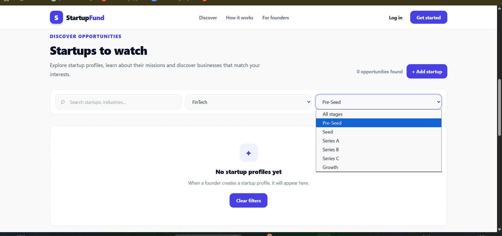
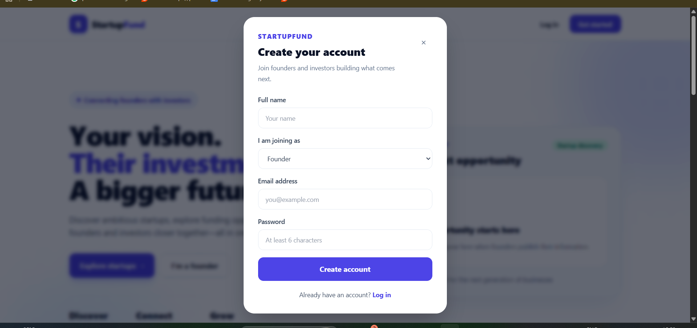
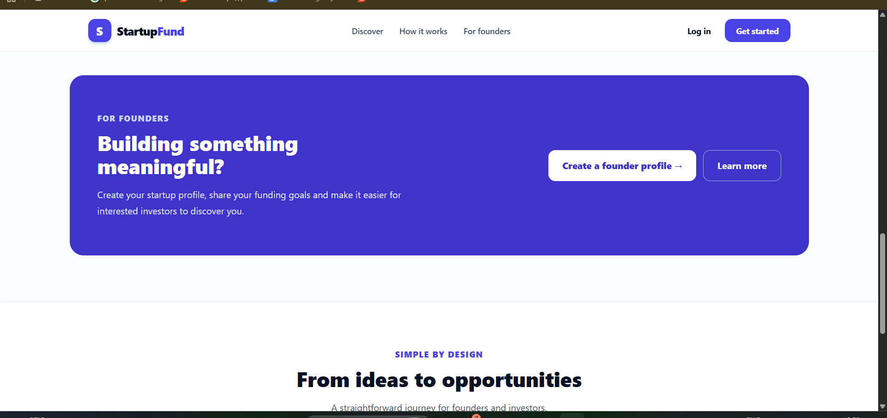
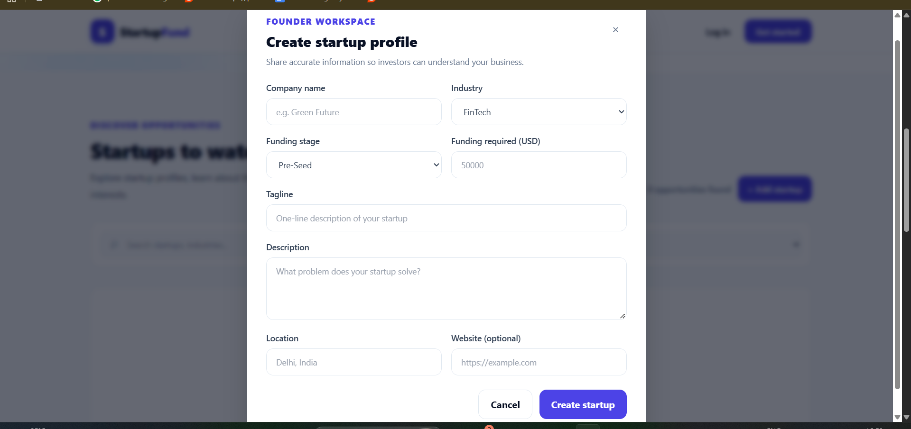

# StartupFund

StartupFund is a MERN stack application that helps founders publish
startup profiles and lets investors discover, filter, and shortlist
startups.

## Screenshots

### 1. Homepage


### 2. Startup discovery and filters



### 3. Registration



### 4. For founders



### 5. Create startup profile



## Features

-   User registration and login with Founder and Investor roles
-   Password hashing and JWT-based authentication
-   Create, view, update, and delete startup profiles (founders can
    manage their own profiles)
-   Discover startups with search and industry/funding-stage filters
-   View startup details, including funding needs and location
-   Investor shortlist stored in MongoDB
-   Protected API routes and role-based permissions
-   Responsive React interface

## Technologies Used

-   **Frontend:** React, Vite, Tailwind CSS
-   **Backend:** Node.js, Express.js
-   **Database:** MongoDB with Mongoose
-   **Authentication:** JSON Web Tokens (JWT), bcrypt
-   **Testing:** Jest/Supertest-based test setup

## Prerequisites

-   Node.js and npm
-   A MongoDB database, such as MongoDB Atlas or a local MongoDB
    instance

## Setup and Installation

### 1. Clone the repository

``` bash
git clone git clone https://github.com/prachi3761/StartupFund.git
cd StartupFund

```


### 2. Configure the backend

``` bash
cd server
npm install
```

Create a `.env` file inside the `server` directory:

``` env
PORT=5000
MONGO_URI=mongodb+srv://<username>:<password>@<cluster-host>/startupfund?appName=Cluster0
JWT_SECRET=replace_with_a_long_random_secret
JWT_EXPIRES_IN=7d
```

Use your own MongoDB connection details and a strong, private JWT
secret. Do not commit `.env` to GitHub.

For a local MongoDB installation, `MONGO_URI` can be set to:

``` env
MONGO_URI=mongodb://localhost:27017/startupfund
```

### 3. Start the backend

From the `server` directory:

``` bash
npm run dev
```

The API runs on `http://localhost:5000` by default. A health endpoint is
available at `http://localhost:5000/api/health`.

### 4. Configure and start the frontend

Open a second terminal from the repository root:

``` bash
cd client
npm install
npm run dev
```

Open the local URL printed by Vite, usually `http://localhost:5173`.

Keep both the backend and frontend terminals running while using the
application.

## API Overview

  -----------------------------------------------------------------------------
  Method                  Endpoint                      Purpose
  ----------------------- ----------------------------- -----------------------
  POST                    `/api/auth/register`          Register a user

  POST                    `/api/auth/login`             Log in

  GET                     `/api/discover`               Discover startups;
                                                        supports search and
                                                        filters

  GET                     `/api/startups/mine`          Get the logged-in
                                                        founder's startups

  POST                    `/api/startups`               Create a startup
                                                        profile

  GET                     `/api/startups/:id`           Get a startup by ID

  PATCH                   `/api/startups/:id`           Update an owned startup

  DELETE                  `/api/startups/:id`           Delete an owned startup

  GET                     `/api/shortlist`              Get the logged-in
                                                        investor's shortlist

  POST                    `/api/shortlist/:startupId`   Add a startup to the
                                                        shortlist

  DELETE                  `/api/shortlist/:startupId`   Remove a startup from
                                                        the shortlist
  -----------------------------------------------------------------------------

Protected endpoints require a bearer token. Startup create/update/delete
endpoints are restricted to the owning founder; shortlist endpoints are
restricted to investors.

## Running Tests

From the `server` directory:

``` bash
npm test
```

Run the command locally to see the current test results.

## AI Development Experience

**AI development tool:** Kiro was used during development. Its free
usage limit was reached, so some implementation and follow-up work was
completed with manual coding and debugging assistance.

AI assistance was used as a development aid, while the resulting code
and behavior were reviewed and tested during implementation.

### Specific AI-assisted tasks

1.  **React UI development:** Assistance with building and refining the
    StartupFund interface, including the discovery section, startup
    cards, details modal, and authentication modal.
2.  **REST API implementation:** Assistance with structuring Express
    routes and API calls for authentication, startup discovery, and
    startup profile management.
3.  **MongoDB integration:** Assistance with connecting Mongoose models
    and API controllers for startup profiles and investor shortlists.
4.  **Debugging and integration:** Assistance with diagnosing API
    connectivity, environment configuration, and frontend/backend
    integration issues.
5.  **Testing and verification:** Assistance with updating the
    health-endpoint test and planning checks for authentication, startup
    CRUD, and shortlist behavior.

AI-generated suggestions were reviewed and adapted to the project rather
than treated as automatically correct.

## Project Structure

``` text
StartupFund/
├── client/       # React + Vite frontend
├── server/       # Express API, Mongoose models, routes, controllers, tests
├── screenshots/  # README screenshots
└── README.md
```

## Security Notes

-   Keep `.env` and all secrets out of version control.
-   Never publish database credentials or JWT secrets.
-   Configure allowed frontend origins appropriately before deploying.
